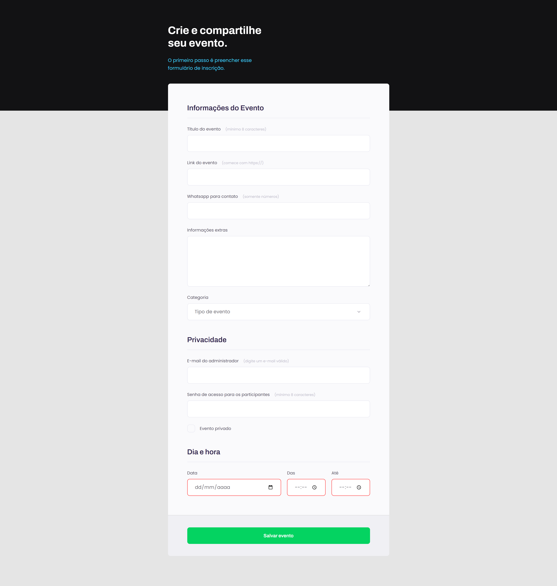

<h1 align="center">Formulário de Agendamento</h1>

## 📋 Descrição do projeto

O <strong>forms</strong> é um projeto construído para a assimilação e aplicação dos conhecimentos sobre a construção de formulários com <strong><em>HTML</em></strong> e <strong><em>CSS</em></strong>.

- Formulário desenvolvido durante o stage 03 da Trilha Explorer da <a href="https://www.rocketseat.com.br/">@Rocketseat</a>.

> HTML:
- Tipos de inputs;
- Atributo <em>action</em> e <em>method</em>;
- Aninhamento de labels com seus respectivos inputs para organização;
- Utilização de <em>divs</em> dentro dos <em>fieldsets</em> para evitar bugs com o <em>legend</em>;
- Validações.
 
> CSS:
- Modo de exibição dos elementos;
- Box-sizing;
- Transformações de textos;
- Pseudo-classes;
- Propriedades de posição dos elementos;
- Modificações do <em>checkbox</em> e <em>select</em> sem perder a acessibilidade;
- Vendor prefixes.

> Protótipo:

🔗 [Clique aqui para acessar](https://nathxrz.github.io/TrilhaExplorer-forms01-stage-03/)
 

## 🛠️ Tecnologias
- HTML
- CSS

## 📩 Contato
> 📧 nathyrezendemachado@gmail.com  
> 💼 <a href="https://www.linkedin.com/in/nathalia-machado-021b1b230/"> LinkedIn</a>  

    